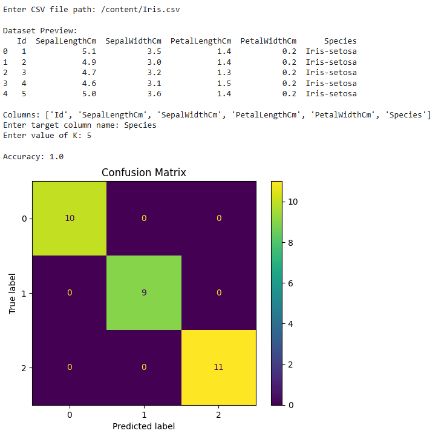

# 🔍 KNN Classification using Custom Dataset (CSV)

## 📌 Overview

This project implements the **K-Nearest Neighbors (KNN)** algorithm for classification using a **user-provided CSV dataset**.
The program allows users to upload their own dataset, choose the target column, and select the value of K.

---

## 🎯 Objective

* To understand and implement the KNN algorithm
* To work with real-world datasets
* To evaluate model performance using accuracy and confusion matrix

---

## 🛠️ Technologies Used

* Python 🐍
* NumPy
* Pandas
* Matplotlib
* Scikit-learn

---

## ⚙️ Features

* 📂 Accepts custom CSV file input
* 🧠 User selects target column
* 🔢 Supports dynamic K value
* ⚡ Data preprocessing using StandardScaler
* 📊 Accuracy calculation
* 📉 Confusion Matrix visualization

---

## 📁 How It Works

1. User provides CSV file path
2. Dataset is loaded and preview displayed
3. User selects the target column
4. Data is split into training and testing sets
5. Features are normalized
6. KNN model is trained
7. Predictions are made
8. Accuracy and confusion matrix are displayed

---

## ▶️ How to Run

### Step 1: Install Libraries

```bash
pip install numpy pandas matplotlib scikit-learn
```

### Step 2: Run the Program

```bash
python knn.py
```

### Step 3: Provide Inputs

```
Enter CSV file path: /content/Iris.csv  
Enter target column name: Species  
Enter value of K: 5  
```

---

## 📊 Sample Output

* ✅ Accuracy: **1.0 (100%)**
* 📉 Confusion Matrix showing perfect classification

---

## 📸 Output Screenshot



---

## 🧠 Key Concepts

* KNN is a **distance-based algorithm**
* Works on **similarity between data points**
* Requires **feature scaling**
* Simple but powerful for classification tasks

---

## 🚀 Result

The model successfully classified all test samples correctly using the Iris dataset, achieving **100% accuracy**.

---

## 📚 Learning Outcomes

* Practical implementation of KNN
* Handling custom datasets
* Data preprocessing techniques
* Model evaluation methods

---

## 👨‍💻 Author

PRIYANSH BHATT

---

## ⭐ Note

This project is part of a machine learning internship task and demonstrates the practical use of KNN on real datasets.
